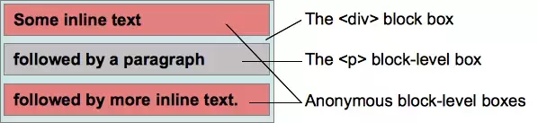

# BFC

## 什么是BFC
```
BFC全称是Block Formatting Context，即块格式化上下文。他是CSS2.1规范定义的，关于CSS渲染定位的一个概念。要明白BFC到底是什么，首先来看看什么是视觉格式化模型。
```
## 二、视觉格式化模型
视觉格式化模型(visual formatting model)是用来处理文档并将它显示在视觉媒体上的机制，他也是CSS中的一个概念。

视觉格式化模型定义了盒(Box)的生成，盒主要包含了块盒、行内盒、匿名盒(没有名字不能被选择器选中的盒)以及一些实验性的盒(未来可能添加到规范中)。盒的类型由display属性决定。
### 2.1块盒(block box)
块盒有一下特性：
- 当元素的css属性display为block，list-item或table时，他是块级元素block-level;
-视觉上呈现为块，竖直排列;
-块级盒参与(块格式化上下文);
-每个块级元素至少生成一个块级盒，称为主要会块级盒(principal block-level box)。一些元素，比如<li>，生成额外的盒来放置项目符号，不过多数元素只生成一个主要块级盒

### 2.2行内盒(inline box)

- 当元素的css属性display的计算值为inline，inline-block或inline-table时，称它为行内级元素
-视觉上它将内容与其他行内级元素排列为多行；典型的如段落内容，有文本（可以有多重格式譬如着重），或图片，都是行内级元素；
-行内级元素生成行内级盒(inline-level boxes)，参与行内格式化上下文(inline formatting context)。同时参与生成行内格式化上下文的行内级盒称为行内盒(inline-boxes)。所有display:inline的非替换元素生成的盒是行内盒；
-不参与生成行内格式化上下文的行内级盒称为原子行内级盒(atomic inline-level boxes)。这些盒由可替换行内元素，或display值为inline-block或inline-table的元素生成，不能拆分成多个盒；

### 2.3 匿名盒(anonymous box)
匿名盒也有分匿名块盒与匿名行内盒，因为匿名盒没有名字，不能利用选择器来选择他们，所以他们的所有属性都为inherit或初始默认值；

如下面例子，会创建匿名块盒来包含毗邻的行内级盒：

```html
<div>
    Some inline text
    <p>followed by a paragraph</p>
    followed by more inline text
</div>
```

